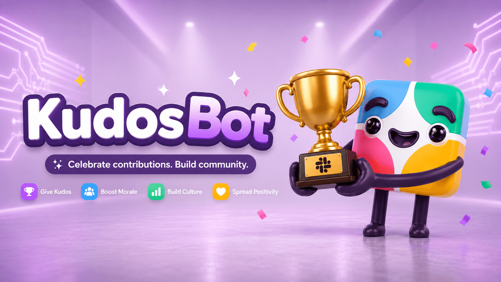

# KudosBot



A friendly Slack bot for celebrating great work. Type `/kudos`, pick a coworker, share why they deserve it, and the bot handles the rest. Weekly reminders keep the momentum going; every two weeks the winners get shouted out in a shared channel and receive their kudos privately by DM.

Under the hood: eligibility is enforced against a rolling 14-day window per nominator/recipient pair, descriptions are kept private, and every operational decision — from the reporting cadence to the DynamoDB access pattern — has a written rationale.

## How this repo works (spec-driven development)

Behavior is defined in [`docs/`](docs/) _before_ it's implemented in code. Every numbered doc (`00` through `19`) is authoritative for its area — business rules, event contracts, data model, security posture, deployment procedure. When code and docs disagree, the doc is right and the code is a bug. Major architecture calls live as ADRs in [`docs/adr/`](docs/adr/) and can only be replaced through another ADR.

Before making a change, read the doc for that area. [`CLAUDE.md`](CLAUDE.md) has a context-routing table that maps common tasks to the right doc. When behavior changes, the doc changes in the same PR.

### The docs

| Area                                                  | Doc                                                                             |
| ----------------------------------------------------- | ------------------------------------------------------------------------------- |
| Product scope and user journeys                       | [`01-product-requirements.md`](docs/01-product-requirements.md)                 |
| Nomination, eligibility, reporting, publication rules | [`02-business-rules.md`](docs/02-business-rules.md)                             |
| Slack surfaces (commands, modal, permissions)         | [`03-slack-app-design.md`](docs/03-slack-app-design.md)                         |
| Service topology and data flow                        | [`04-system-architecture.md`](docs/04-system-architecture.md)                   |
| DynamoDB keys, indexes, transactions, TTL             | [`05-dynamodb-data-model.md`](docs/05-dynamodb-data-model.md)                   |
| SQS payloads and service contracts                    | [`06-event-contracts.md`](docs/06-event-contracts.md)                           |
| AWS resources and IAM boundaries                      | [`07-aws-infrastructure.md`](docs/07-aws-infrastructure.md)                     |
| Terraform layout, state, tagging                      | [`08-terraform-standards.md`](docs/08-terraform-standards.md)                   |
| Secrets, privacy, audit records                       | [`09-security-privacy-audit.md`](docs/09-security-privacy-audit.md)             |
| Reminders, report windows, winner DMs                 | [`10-scheduling-and-reporting.md`](docs/10-scheduling-and-reporting.md)         |
| Logs, metrics, alarms, runbooks                       | [`11-observability-and-operations.md`](docs/11-observability-and-operations.md) |
| Testing strategy and definition of done               | [`12-testing-strategy.md`](docs/12-testing-strategy.md)                         |
| Local development setup                               | [`13-local-development.md`](docs/13-local-development.md)                       |
| CI/CD, releases, rollback                             | [`14-deployment-and-environments.md`](docs/14-deployment-and-environments.md)   |
| Deferred features (Phase 2+)                          | [`15-future-state-backlog.md`](docs/15-future-state-backlog.md)                 |
| Decision register (index of ADRs)                     | [`16-decision-register.md`](docs/16-decision-register.md)                       |
| Branch and PR conventions                             | [`17-developer-workflow.md`](docs/17-developer-workflow.md)                     |
| Slack app registration                                | [`18-slack-app-setup.md`](docs/18-slack-app-setup.md)                           |
| Architecture diagrams                                 | [`19-diagrams.md`](docs/19-diagrams.md)                                         |
| Machine setup                                         | [`00-dependencies.md`](docs/00-dependencies.md)                                 |

## Getting started

Two docs get you from zero to a running local instance:

1. [`docs/00-dependencies.md`](docs/00-dependencies.md) — every tool you need on your machine (Node, pnpm, Slack CLI, ngrok, and the optional AWS/Docker/Terraform bits). Single source of truth for prerequisites.
2. [`docs/18-slack-app-setup.md`](docs/18-slack-app-setup.md) — register the Slack app into your workspace or Developer Program sandbox, populate `.env`, and point the app at your local tunnel.

Then come back here for everyday commands.

### Install

```bash
pnpm install
```

The `prepare` script wires up Husky hooks automatically.

### Everyday commands

| Command                             | What it does                                                                                                            |
| ----------------------------------- | ----------------------------------------------------------------------------------------------------------------------- |
| `pnpm verify`                       | Runs `lint`, `typecheck`, `test`, `build` in sequence — same four checks as CI. Run this before handing off any change. |
| `pnpm lint`                         | ESLint across all workspaces.                                                                                           |
| `pnpm typecheck`                    | `tsc -b` across the workspace graph.                                                                                    |
| `pnpm test`                         | Unit tests (vitest, `unit` project).                                                                                    |
| `pnpm test:integration`             | Integration tests (vitest, `integration` project).                                                                      |
| `pnpm build`                        | Compiles every workspace via `tsc -b`.                                                                                  |
| `pnpm dev`                          | Streams `dev` scripts across workspaces.                                                                                |
| `pnpm format` / `pnpm format:check` | Prettier write / check.                                                                                                 |
| `pnpm infra:validate`               | `terraform fmt -check` + `terraform validate` across `infra/modules` and `infra/environments`.                          |

### Dev-only helper scripts

Direct-invoke helpers for the deployed dev Lambdas. Full docs in
[`scripts/dev/README.md`](scripts/dev/README.md); destructive commands
refuse `--env production` and require `--yes` to actually mutate.

| Command                      | What it does                                                |
| ---------------------------- | ----------------------------------------------------------- |
| `pnpm dev:users`             | Lists Slack workspace users via `users.list`.               |
| `pnpm dev:nominate`          | Enqueues a nomination on the dev SQS queue.                 |
| `pnpm dev:report`            | Invokes the report Lambda (`--sync` for tail logs).         |
| `pnpm dev:reminder`          | Invokes the reminder Lambda directly.                       |
| `pnpm dev:period`            | Read-only preview: counts + winners for a window.           |
| `pnpm dev:recipient`         | Read-only: nominations for one recipient in a window.       |
| `pnpm dev:clear-eligibility` | Deletes a `PAIR_ELIGIBILITY` row so a pair can re-nominate. |
| `pnpm dev:reset-period`      | Wipes nominations + eligibility + report for a window.      |
| `pnpm dev:tail`              | Follows all four dev Lambdas' CloudWatch logs at once.      |

Common workflow when developing against the dev environment — stream every Lambda's logs in one pane so you can watch a `/kudos` invocation flow through ingress, worker, and back to Slack:

```bash
pnpm dev:tail --env dev
```

### Git hooks

Husky enforces the same checks in source control (bypass with `--no-verify` only when you have a specific reason):

- **pre-commit** — blocks direct commits to `main`, warns on non-standard branch prefixes, then runs `pnpm lint && pnpm typecheck`.
- **pre-push** — blocks direct pushes to `main`, then runs `pnpm verify`.

### Developer workflow

Branch off `dev`, open PRs against `dev`, never commit to `main`.

Full conventions (branch prefixes, commit and PR guidance, merge flow) live in [`docs/17-developer-workflow.md`](docs/17-developer-workflow.md).

## Repo layout

```text
apps/         # Lambda entry points: slack-ingress, nomination-worker, reminder-job, report-job
packages/     # domain, slack, persistence, contracts, configuration, observability
infra/        # Terraform modules and per-environment stacks
docs/         # Product, architecture, and operations documentation (spec)
docs/adr/     # Architecture Decision Records — index at docs/16
slack/        # Slack app manifest (source of truth for scopes and commands)
scripts/      # Bootstrap and dev-only operational scripts
```

## Infrastructure

Everything is serverless and scale-to-zero — no long-running servers, no VPC, no NAT. Cost floor is essentially the DynamoDB PITR baseline. Each environment (`dev`, `production`) stands up an isolated copy of the stack; Terraform state is per-environment, keyed inside a shared S3 backend.

### What gets provisioned

| Concern          | Resources                                                                                                                                                                              |
| ---------------- | -------------------------------------------------------------------------------------------------------------------------------------------------------------------------------------- |
| Slack ingress    | API Gateway HTTP API → `slack-ingress` Lambda. Verifies Slack signature, opens the modal, hands accepted submissions off to SQS.                                                       |
| Async processing | `nomination-worker` Lambda consuming an SQS queue with a dead-letter queue. Validates the domain event and executes the DynamoDB transaction that stores the nomination + eligibility. |
| Scheduling       | EventBridge Scheduler firing the `reminder-job` (Fridays 09:00 ET) and `report-job` (biweekly Fridays 12:00 ET) Lambdas in `America/New_York`.                                         |
| Persistence      | Single DynamoDB table (on-demand, PITR enabled, TTL for eligibility rows) with GSI1 for period queries. Optional scheduled export to a private S3 archive bucket.                      |
| Secrets          | Two Secrets Manager entries per environment for the Slack signing secret and bot token. Terraform provisions the containers; the values are populated out-of-band.                     |
| Observability    | CloudWatch log groups per Lambda with explicit retention, DLQ depth alarms, and structured JSON logs. Descriptions and tokens are never logged.                                        |

Each Lambda has its own IAM role with the minimum policies it needs (`docs/07` §IAM boundaries). Full resource inventory and the reasoning behind each choice: [`docs/07-aws-infrastructure.md`](docs/07-aws-infrastructure.md).

### System topology

The full mermaid diagram — every Lambda, queue, table, schedule, and secret with the paths between them — is in [`docs/04-system-architecture.md`](docs/04-system-architecture.md#selected-architecture). An AWS-icon companion for slide-friendly rendering lives at [`docs/diagrams/topology-aws.drawio`](docs/diagrams/topology-aws.drawio) (open in [app.diagrams.net](https://app.diagrams.net/) or the draw.io desktop app). The full diagram index — including the `/kudos` submission sequence, the report execution state machine, and the DynamoDB entity view — is at [`docs/19-diagrams.md`](docs/19-diagrams.md).

### Terraform layout

```text
infra/
  modules/         # api, compute, dynamodb, messaging, scheduling, secrets, observability, archive
  environments/
    dev/           # composes modules; dev-flavored defaults (short retention, force_destroy)
    production/    # composes modules; prod defaults (deletion protection, longer retention)
```

Module conventions and the state model (S3 backend, per-env keys, out-of-band state bucket bootstrap) are in [`docs/08-terraform-standards.md`](docs/08-terraform-standards.md). Two ADRs anchor the shape of this: [ADR-003](docs/adr/ADR-003-serverless-aws-architecture.md) (why serverless) and [ADR-006](docs/adr/ADR-006-terraform-state-and-artifact-buckets.md) (why the state and artifact buckets sit outside Terraform's own management).

### Deployment

First-time stand-up per environment — state bucket bootstrap, artifact bucket, stub Lambdas, `terraform apply`, secret population, Slack request URL wiring, real Lambda upload — is documented step by step in [`docs/14-deployment-and-environments.md`](docs/14-deployment-and-environments.md).

Subsequent releases skip infrastructure: `pnpm build:lambda` produces four zips, `pnpm infra:upload-lambdas <env>` uploads and calls `aws lambda update-function-code`, and the running Lambdas pick up the new code without re-applying Terraform.

## CI

[`.github/workflows/ci.yml`](.github/workflows/ci.yml) runs `lint`,
`typecheck`, `test`, and `build` on every PR, alongside `terraform
fmt`/`validate`, gitleaks (secret scanning), and tfsec (infrastructure
security scanning).

[`.github/workflows/deploy.yml`](.github/workflows/deploy.yml) handles
environment-scoped plan/apply through manual dispatch.
