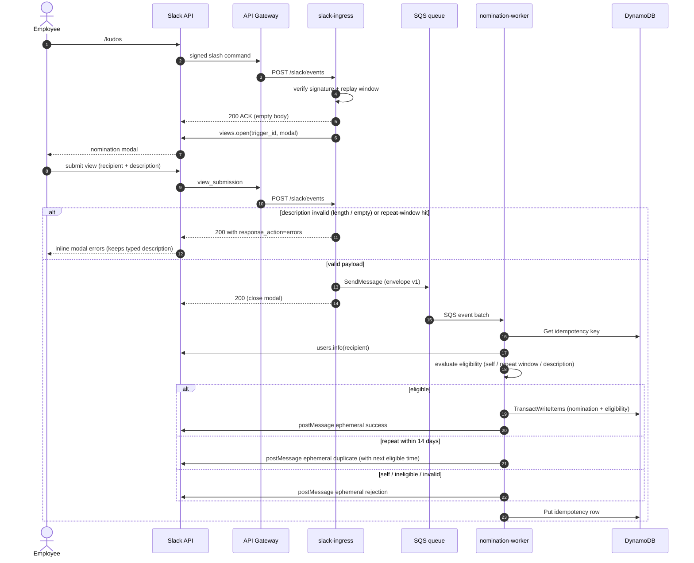

# Slack App Design

## Interaction model

Phase 1 uses Slack HTTP request URLs and `/kudos` as the primary entry point.

### Slash command flow

1. Slack sends the signed command request to API Gateway.
2. The ingress Lambda verifies the signature and replay window.
3. The command is acknowledged immediately.
4. The ingress queries DynamoDB for the nominator's active eligibility records so the modal can display who they've already recognized this cycle.
5. The app uses the command `trigger_id` to open a modal.

If the eligibility lookup fails or is slow, the modal still opens without the hint — Slack's `trigger_id` expires after three seconds, so degrading gracefully matters more than the hint. The command should not parse recipient handles or descriptions from raw command text.

### Submission sequence

End-to-end flow from `/kudos` invocation through modal submission, SQS handoff, atomic write, and feedback DM. Failure branches (invalid description, repeat-window rejection) are folded in as `alt` blocks.



*Call sites: `apps/slack-ingress/src/routes/slashCommand.ts:10` opens the modal; `apps/slack-ingress/src/routes/viewSubmission.ts:104` publishes to SQS; `apps/nomination-worker/src/processMessage.ts:38` runs the worker path; the transaction is issued from `packages/persistence/src/repositories/NominationRepository.ts:66`.*

### Modal

Required inputs:

- `recipient`: Slack `users_select` control.
- `description`: multiline plain-text input, 10 to 1,000 characters.

Validation should reject:

- Self-selection.
- Guest accounts.
- External or Slack Connect accounts.
- Bots and app accounts.
- Deactivated accounts.
- Missing or invalid description.

Eligibility conflicts discovered after submission should be returned privately through the appropriate Slack response mechanism.

The ingress Lambda performs an eligibility pre-check on `view_submission` and returns `response_action=errors` under the recipient block when the same pair is still inside the 14-day window. This keeps the user's typed description intact so they can swap recipients without retyping. The worker still enforces the same rule atomically through the DynamoDB conditional in `TransactWriteItems` (docs/05 §Eligibility lock) — that guard covers the race where two rapid submissions both pass the pre-check.

## Admin surface

`/kudos-admin` is a maintainer-only slash command. Only Slack user IDs in `SLACK_MAINTAINER_IDS` can invoke it; every other caller receives an ephemeral rejection. Responses are ephemeral (rendered inline via `response_type: "ephemeral"` on the immediate slash-command response) — no `chat.postEphemeral` scope needed.

Subcommands (Phase 1):

- `/kudos-admin report` — publish the biweekly report for the current period on demand. The ingress Lambda asynchronously invokes the report Lambda with `BiweeklyReportRequestedV1 { forceRepublish: true, ...currentPeriod }`. The report Lambda overwrites any existing `REPORT_EXECUTION` row for that period back to `PENDING`, re-posts to the recognition channel, and re-sends winner DMs. This is an intentional exception to the "never re-publish" idempotency rule; scheduled EventBridge runs never set `forceRepublish` and continue to honor it.
- `/kudos-admin` with no subcommand or `help` — returns usage.

The route uses `periodContaining(now)` (packages/domain) to compute the active reporting period, so admin invocations always target the currently-open window. Custom period ranges are backlog work.

## Response visibility

| Outcome | Visibility |
|---|---|
| Successful nomination | Ephemeral to nominator |
| Validation failure | Modal error or ephemeral |
| Duplicate within 14 days | Ephemeral with next eligible time |
| Weekly reminder | Shared recognition channel |
| Biweekly report | Shared recognition channel |
| Winner descriptions | Direct message to each winner |

## Suggested copy

Success:

> Recognition for <@RECIPIENT_ID> is in. Thanks for the shout-out.

Self-nomination:

> Recognition is for teammates — pick someone else to celebrate.

Duplicate:

> <@RECIPIENT_ID> is already recognized this cycle. You can nominate them again after {localizedNextEligibleAt}.

Ineligible account:

> That account can't receive recognition. Please pick an active teammate in this workspace.

Program disclaimer footer (appended to the weekly reminder and biweekly report — both winner and no-activity variants — as a `context` block; not shown in DMs or ephemeral responses):

> KudosBot is for informal peer recognition only and does not replace or impact formal employee reviews. Official performance evaluations continue through our standard HR process.

## Channel configuration

Reminders and reports use one shared channel. Its Slack channel ID is supplied as deployment configuration, for example:

```text
SLACK_RECOGNITION_CHANNEL_ID=C0123456789
```

Do not commit the real channel ID to the public repository.

## Maintainers

Maintainer Slack IDs are supplied as a configuration list, for example:

```text
SLACK_MAINTAINER_IDS=U123456,U789012
```

Anyone may use `/kudos`. Maintainer privileges are reserved for current or future administrative operations and audit access.

## OAuth scopes

Required initial bot scopes:

- `commands`
- `chat:write`
- `users:read`
- `im:write` — needed by the nomination worker's `conversations.open` call to open the DM channel it then posts feedback to. `chat:write` alone lets the bot post into an existing DM but not create one.

Avoid broad channel-read scopes unless the application actually browses or validates channels through the Conversations API.

The bot should be invited to the configured recognition channel rather than receiving broad permission to post to arbitrary public channels.

## Slack identity handling

Persist immutable Slack IDs. Display names and handles may be saved only as optional snapshots for user-friendly logs or messages.

Recipient validation should inspect relevant Slack user profile fields such as deleted status, bot/app identity, guest restrictions, workspace/team identity, and enterprise/external status.

## Installation scope

Phase 1 is installed in one private production workspace and is not published to the Slack Marketplace. The data model remains workspace-aware to avoid a future migration.
