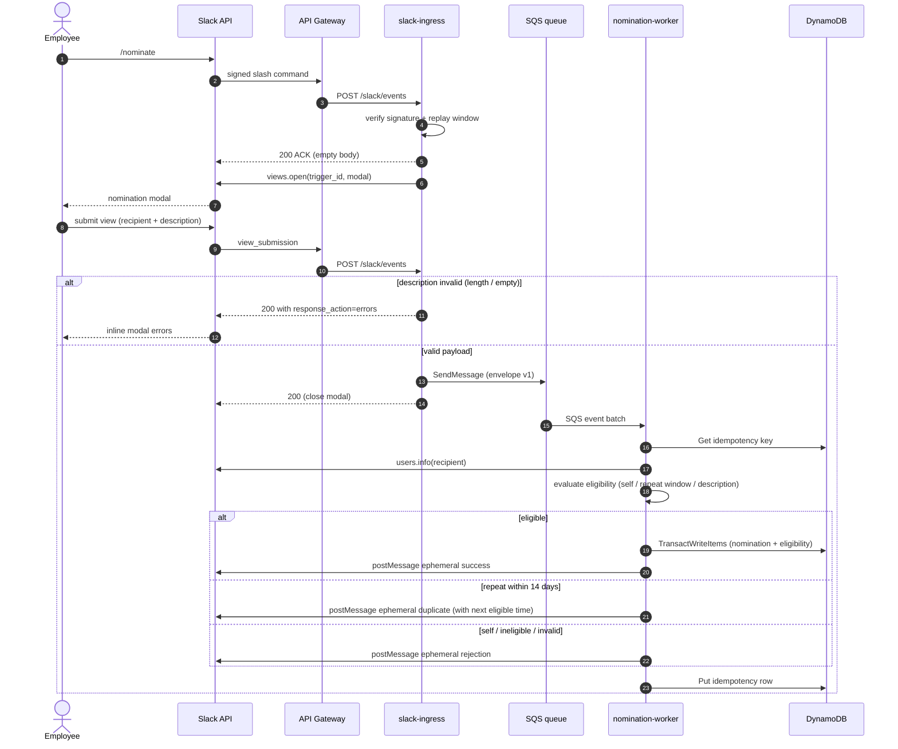

# Slack App Design

## Interaction model

Phase 1 uses Slack HTTP request URLs and `/nominate` as the primary entry point.

### Slash command flow

1. Slack sends the signed command request to API Gateway.
2. The ingress Lambda verifies the signature and replay window.
3. The command is acknowledged immediately.
4. The app uses the command `trigger_id` to open a modal.

The command should not parse recipient handles or descriptions from raw command text.

### Submission sequence

End-to-end flow from `/nominate` invocation through modal submission, SQS handoff, atomic write, and feedback DM. Failure branches (invalid description, repeat-window rejection) are folded in as `alt` blocks.



*Call sites: `apps/slack-ingress/src/routes/slashCommand.ts:10` opens the modal; `apps/slack-ingress/src/routes/viewSubmission.ts:104` publishes to SQS; `apps/nomination-worker/src/processMessage.ts:38` runs the worker path; the transaction is issued from `packages/persistence/src/repositories/NominationRepository.ts:66`.*

### Modal

Required inputs:

- `recipient`: Slack `users_select` control.
- `description`: multiline plain-text input, 10 to 1,000 characters.

Validation should reject:

- Self-selection.
- Guest accounts.
- External or Slack Connect accounts.
- Bots and app accounts.
- Deactivated accounts.
- Missing or invalid description.

Eligibility conflicts discovered after submission should be returned privately through the appropriate Slack response mechanism.

## Response visibility

| Outcome | Visibility |
|---|---|
| Successful nomination | Ephemeral to nominator |
| Validation failure | Modal error or ephemeral |
| Duplicate within 14 days | Ephemeral with next eligible time |
| Weekly reminder | Shared recognition channel |
| Biweekly report | Shared recognition channel |
| Winner descriptions | Direct message to each winner |

## Suggested copy

Success:

> Your nomination for <@RECIPIENT_ID> was recorded. Thanks for recognizing their work.

Self-nomination:

> You cannot nominate yourself. Please choose another teammate.

Duplicate:

> You already nominated <@RECIPIENT_ID> within the last 14 days. You can nominate them again after {localizedNextEligibleAt}.

Ineligible account:

> That account cannot receive nominations. Please choose an active employee in this workspace.

## Channel configuration

Reminders and reports use one shared channel. Its Slack channel ID is supplied as deployment configuration, for example:

```text
SLACK_RECOGNITION_CHANNEL_ID=C0123456789
```

Do not commit the real channel ID to the public repository.

## Maintainers

Maintainer Slack IDs are supplied as a configuration list, for example:

```text
SLACK_MAINTAINER_IDS=U123456,U789012
```

Anyone may use `/nominate`. Maintainer privileges are reserved for current or future administrative operations and audit access.

## OAuth scopes

Required initial bot scopes:

- `commands`
- `chat:write`
- `users:read`

Add `im:write` when required by the chosen Slack DM-opening implementation. Avoid broad channel-read scopes unless the application actually browses or validates channels through the Conversations API.

The bot should be invited to the configured recognition channel rather than receiving broad permission to post to arbitrary public channels.

## Slack identity handling

Persist immutable Slack IDs. Display names and handles may be saved only as optional snapshots for user-friendly logs or messages.

Recipient validation should inspect relevant Slack user profile fields such as deleted status, bot/app identity, guest restrictions, workspace/team identity, and enterprise/external status.

## Installation scope

Phase 1 is installed in one private production workspace and is not published to the Slack Marketplace. The data model remains workspace-aware to avoid a future migration.
