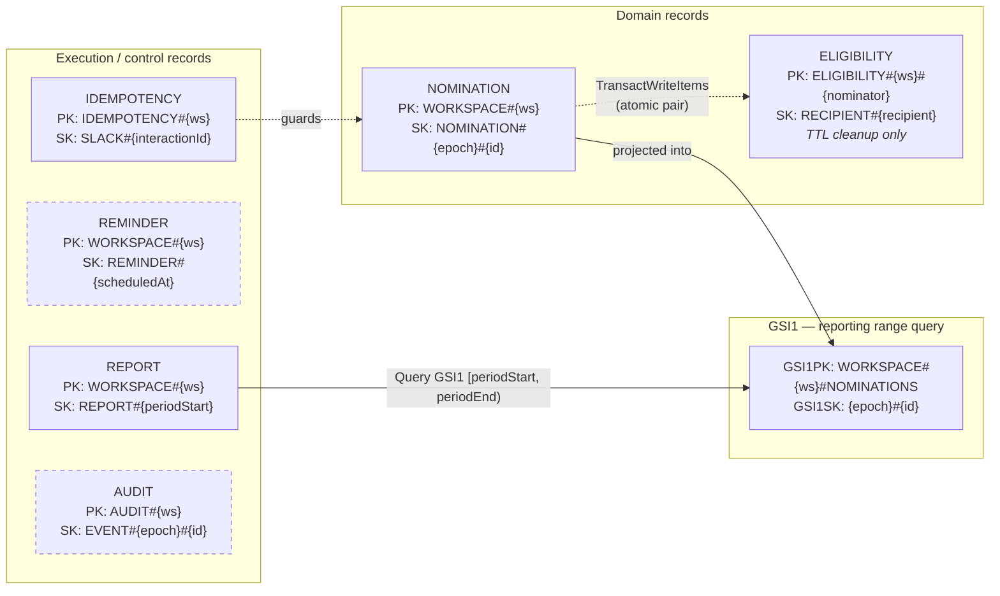

# DynamoDB Data Model

## Design goals

- Enforce the rolling 14-day pair restriction atomically.
- Support reporting by workspace and submission time.
- Preserve nominator attribution for audits.
- Support one-year operational retention.
- Remain workspace-aware while serving one production workspace in Phase 1.
- Avoid scans for routine nomination and report operations.

## Recommended table strategy

Use one DynamoDB table for Phase 1 domain and execution records. Enable on-demand capacity, point-in-time recovery, server-side encryption, and TTL for retention cleanup.

Example table name:

```text
{project}-{environment}-app
```

## Entity patterns

### Overview

Six entity types share one table via `PK`/`SK` prefixes, plus a single global secondary index (`GSI1`) that projects nominations for reporting range queries.



*Legend: dashed borders mark entity types whose repositories are still stubs (`ReminderRepository`, `AuditRepository`).*

### Nomination

```text
PK = WORKSPACE#{workspaceId}
SK = NOMINATION#{submittedAtEpochMs}#{nominationId}
```

Attributes:

```ts
interface NominationItem {
  entityType: "NOMINATION";
  workspaceId: string;
  nominationId: string;
  nominatorSlackId: string;
  recipientSlackId: string;
  description: string;
  submittedAt: string;
  submittedAtEpochMs: number;
  reportPeriodStart: string;
  reportPeriodEnd: string;
  sourceChannelId?: string;
  sourceType: "CHANNEL" | "DM";
  status: "ACTIVE";
  retentionExpiresAt: number;
}
```

Phase 1 writes only `ACTIVE`. A future `INVALIDATED` state is documented in the backlog.

### Eligibility lock

```text
PK = ELIGIBILITY#{workspaceId}#{nominatorSlackId}
SK = RECIPIENT#{recipientSlackId}
```

Attributes:

```ts
interface EligibilityItem {
  entityType: "ELIGIBILITY";
  workspaceId: string;
  nominatorSlackId: string;
  recipientSlackId: string;
  nominationId: string;
  acceptedAt: string;
  nextEligibleAt: string;
  nextEligibleAtEpoch: number;
  ttl: number;
}
```

TTL is cleanup only. Application conditions must compare `nextEligibleAtEpoch` with the current epoch.

### Report execution

```text
PK = WORKSPACE#{workspaceId}
SK = REPORT#{periodStart}
```

Attributes include period boundaries, status, winner IDs, counts, Slack message timestamp, published time, DM delivery states, and retention policy.

### Reminder execution

```text
PK = WORKSPACE#{workspaceId}
SK = REMINDER#{scheduledAt}
```

Use a conditional put so a retry cannot post the same reminder twice.

### Audit event

```text
PK = AUDIT#{workspaceId}
SK = EVENT#{occurredAtEpochMs}#{eventId}
```

Audit events should contain identifiers and event metadata, not duplicate full descriptions unless there is a defined need.

## Reporting index

Create a GSI that supports nominations by workspace and submission time:

```text
GSI1PK = WORKSPACE#{workspaceId}#NOMINATIONS
GSI1SK = {submittedAtEpochMs}#{nominationId}
```

The report job queries `GSI1PK` with a numeric sort-key range corresponding to `[periodStart, periodEnd)`.

## Atomic nomination transaction

Use `TransactWriteItems` to perform both operations:

1. Put the immutable nomination record with a condition that the nomination ID does not exist.
2. Put or update the eligibility record only when:
   - it does not exist, or
   - its stored `nextEligibleAtEpoch <= nowEpoch`.

The transaction must fail as a unit when the pair is still restricted.

A conceptual eligibility condition:

```text
attribute_not_exists(PK) OR nextEligibleAtEpoch <= :now
```

Use expression attribute names where required and return cancellation reasons in controlled non-production diagnostics.

## Idempotency

Derive or persist an idempotency key from the Slack interaction payload. Reprocessing the same modal submission must return the previously created result rather than generating a second nomination.

A separate idempotency item may use:

```text
PK = IDEMPOTENCY#{workspaceId}
SK = SLACK#{interactionId}
```

Create it in the same transaction when feasible.

## Retention

- Nomination operational records: one year.
- Eligibility records: TTL shortly after `nextEligibleAt`.
- Execution records: long enough to support operational audits and retries.
- Published aggregate report records: retain indefinitely unless policy changes.
- S3 archive: recommended three-year lifecycle, subject to organizational policy.

## Backup

- Enable DynamoDB point-in-time recovery.
- Schedule DynamoDB exports to encrypted S3.
- Enable S3 versioning and lifecycle transitions/deletion.
- Restrict bucket access to dedicated operational roles.
- Never make exported employee-recognition data public.
