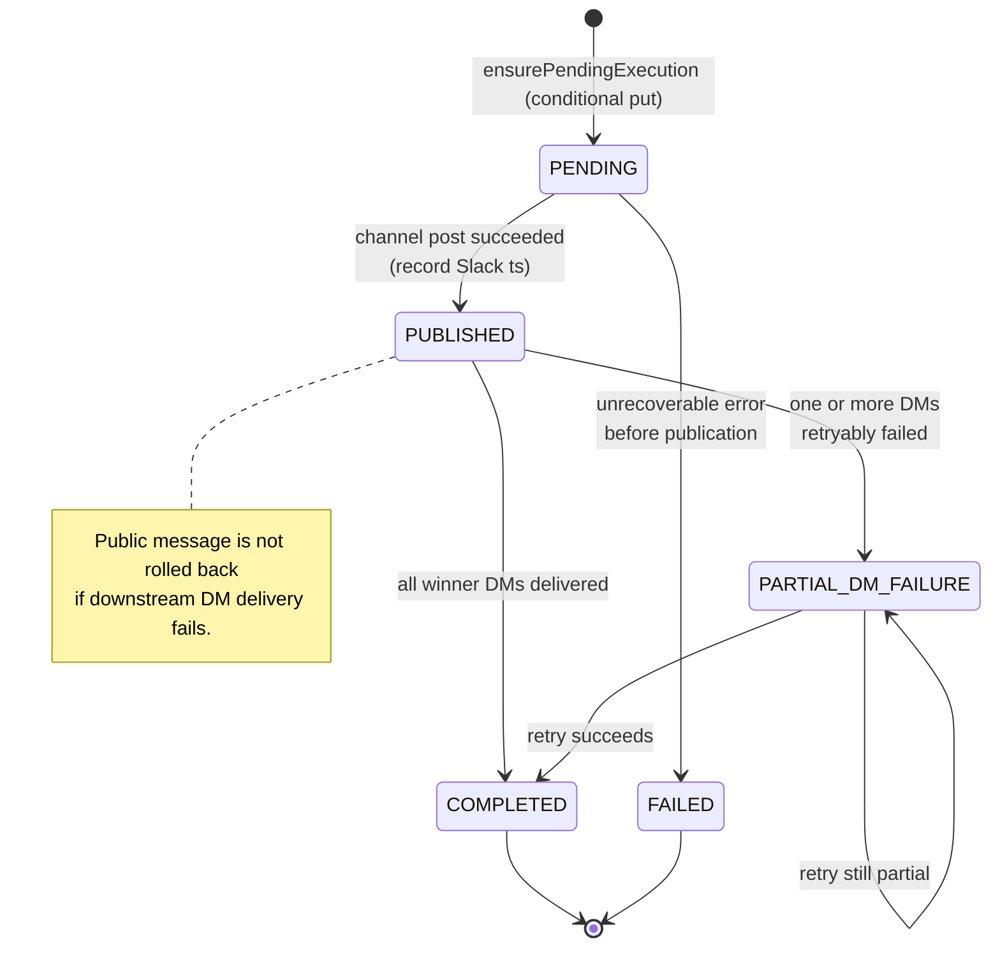

# Scheduling and Reporting

## Timezone and anchor

All user-facing schedules use `America/New_York`.

- Program start: Friday, July 31, 2026 at 12:00 AM.
- First reminder: Friday, August 7, 2026 at 9:00 AM.
- First report: Friday, August 14, 2026 at 12:00 PM.

Use EventBridge Scheduler timezone-aware schedules rather than converting these times to a permanent UTC offset.

## Weekly reminder

- Runs every Friday at 9:00 AM local time.
- Posts to the single configured recognition channel.
- Encourages employees to use `/nominate`.
- Uses an execution key derived from workspace and scheduled time.
- A retry must not create a duplicate reminder.

## Biweekly report

- Runs every other Friday at 12:00 PM local time.
- The first report runs August 14, 2026.
- Reporting windows are fixed and half-open: `[start, end)`.
- Eligibility remains rolling and is not reset at report boundaries.

## First period

```text
Start: 2026-07-31 00:00 America/New_York, inclusive
End:   2026-08-14 12:00 America/New_York, exclusive
```

A nomination at exactly August 14 at 12:00 PM belongs to the second period.

## Aggregation

1. Query valid nominations for the period.
2. Group by recipient Slack ID.
3. Count one point per nomination.
4. Determine the maximum count.
5. Publish all recipients whose count equals the maximum.
6. If there are no nominations, publish a no-activity message.

## Public message

The public report contains:

- Winner or tied winner mentions.
- Nomination count per winner.
- A short recognition message.

It excludes:

- Nominator identities.
- Nomination descriptions.

## Winner DMs

After the public report is recorded as published:

- Send each winner only their descriptions.
- Do not reveal nominators.
- Track each DM attempt separately.
- Retry retryable failures.
- Do not duplicate a successfully delivered DM.
- Do not roll back the public report if a DM fails.

## Idempotency state

Create a report execution item keyed by workspace and period start. Track:

- `PENDING`
- `PUBLISHED`
- `PARTIAL_DM_FAILURE`
- `COMPLETED`
- `FAILED`

Persist the public Slack message timestamp and per-winner DM state.



*Anchored in `apps/report-job/src/runReport.ts` (`ensurePendingExecution`, `ensurePublished`, `deliverWinnerDms`) and `packages/persistence/src/repositories/ReportRepository.ts` (state field updates via conditional put + update).*

## Schedule failure behavior

- EventBridge retries according to configured policy.
- The target may use a DLQ where supported.
- Duplicate invocations resolve through conditional report/reminder execution records.
- Alarms notify operators when publication or winner delivery remains incomplete.
